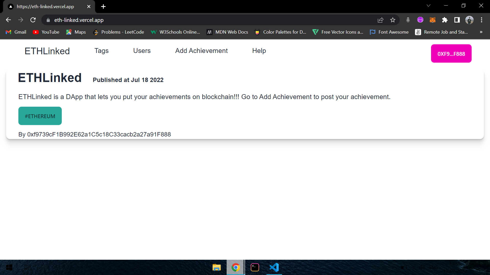
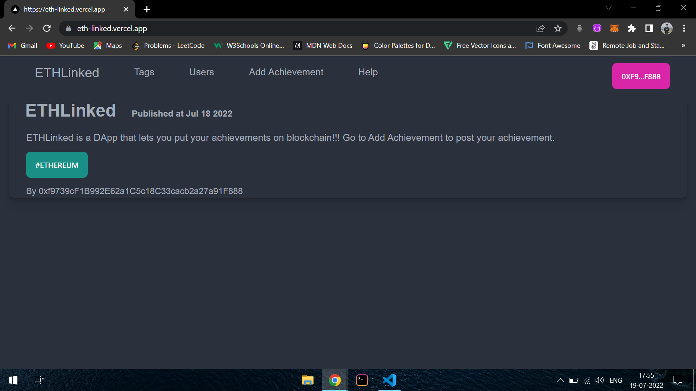

<h1 align = "center">ETHLinked 🏆</h1>

ETHLinked is a decentralized app(DApp) that lets you put all of your achievement on blockchain. With ETHLinked you can now post all of your achievemnts on ethereum network with the guarantee that your data will never change and it will not be owned by any central authority. To use ETHLinked you need to install metamask and then connect to the ropsten testnet. You can add title, description(350 words), tag(15 words) for a particular achievement. Comment feature is currenlty disabled but will soon be available where others users can comment on your achievement. It also supports dark mode and light mode depending on system default settings.

 
 

## How it works :
 
<ul>
  <li>To start posting your achievement. Connect ETHLinked with metamask.</li>
  <li>Switch your network to Ropsten testnet.</li>
  <li>Add your achievement by visiting the add achievement tab</li>
  <li>Add your achievement. Title can only be of 100 words whereas description and tag can only be of 350 words and 15 words respectively.</li>
  <li>Click on add achievement.</li>
  <li>Tada. Your achievement is now posted on blockchain!🥳</li>
 </ul>

 
 

## 🌞 Light Mode

 
 

## 🌑 Dark Mode

 
 

## 👩‍🔧 Contributing

To start contributing make sure you have <a href = "https://nodejs.org/en/download/">Nodejs</a> and <a href = "https://git-scm.com/">Git</a> installed in your system.

 After installing following requirements, perform the following steps -

 - Fork the repository.
 - Clone the repository using `git clone <repository-url>`
 - Create a new branch using `git checkout -b <branch-name>`
 - Change the directory to app using `cd app`
 - Install dependencies using `npm install`
 - Run the app using `npm run dev`
 - Once you are done making your changes stage your changes using `git add .`
 - Commit your changes using `git commit -m "message"`
 - Push your changes to the remote repository using `git push origin <branch-name>`

 
Note: Making any changes to the smart contract is not allowed currently because of the immutable nature of smart contracts. To submit any changes smart contracts needs to be redeployed that will result in loosing all the previous achievements and data.

 
 

## 🤔 Bug Reports/Feature Requests

Kindly open an issue if you face any king of bug or any other kind of problem by going <a href = "https://github.com/VaibhavArora19/ETHLinked/issues/new?assignees=&labels=&template=bug_report.md&title=">here</a>. You can also make a feature by creating a feature request <a href = "https://github.com/VaibhavArora19/ETHLinked/issues/new?assignees=&labels=&template=bug_report.md&title=">here</a>.

## Support

Kindly support me if you like the project by starring 🌟 the project. It'll be much appreciated 😄.